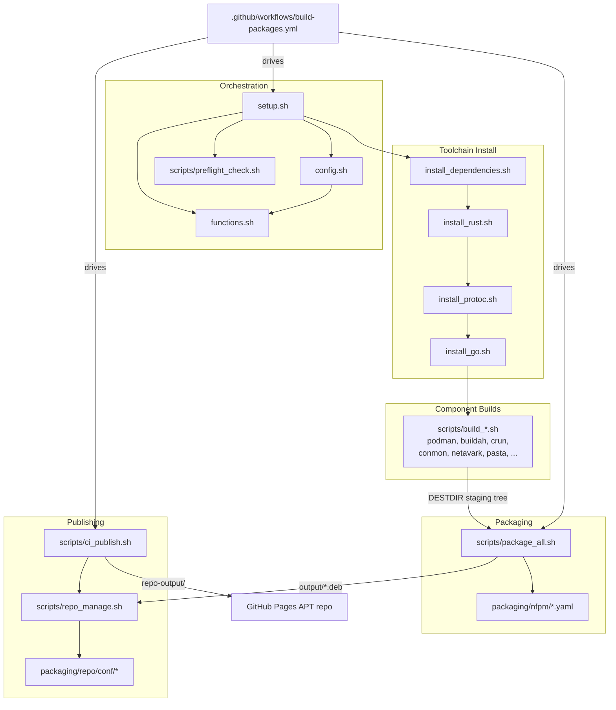

# Architecture

## System Overview

This project is a **source-to-package build and distribution system** for the
Podman container stack on Ubuntu 24.04 and 26.04 (amd64 and arm64). It takes upstream
source repositories (Podman, Buildah, crun, etc.) as input and produces signed
`.deb` packages plus a hosted APT repository as output.

The architecture is a **shell-orchestrated build pipeline** rather than an
application: a top-level orchestrator (`setup.sh`) sources a shared
configuration and function library, then runs a sequence of per-component
build scripts that compile each upstream project from source into a common
staging tree (`DESTDIR`). A packaging stage (`scripts/package_all.sh`) converts
the staging tree into Debian packages with [nFPM](https://nfpm.goreleaser.com/),
and a publishing stage (`scripts/repo_manage.sh` / `scripts/ci_publish.sh`)
assembles those packages into a [reprepro](https://wiki.debian.org/reprepro)
APT repository of 8 suites (two rolling aliases plus per-distro suites for
Ubuntu 24.04 and 26.04) deployed to GitHub Pages. A GitHub Actions workflow
drives the whole pipeline across three release tracks (stable, v5, nightly)
on native amd64 and arm64 runners.

## Component Diagram



The pipeline is linear: install toolchain, build all components into a shared
staging tree, package the tree, then publish. CI fans the build out across two
native architecture runners before merging artifacts in a single publish job.

## Data Flow

A typical end-to-end run (driven by `.github/workflows/build-packages.yml`)
moves through the system as follows:

1. **Track resolution.** The workflow resolves a build track (`stable`, `v5`,
   or `nightly`). For `stable` (the Podman 6.x line) and `v5` (the Podman 5.x
   maintenance line), `scripts/resolve_versions.sh` reads a *policy* file
   (`versions-stable.env` / `versions-v5.env`) and materializes concrete
   `*_TAG`s. Precedence per component is: an exact `*_TAG` freeze wins; otherwise
   a `*_SERIES` anchored-prefix cap (e.g. `PODMAN_SERIES=6` selects the highest
   `6.x` tag); otherwise the tag floats to the latest upstream release. Buildah
   is *derived* from Podman's `go.mod` at the resolved Podman tag rather than
   resolved independently. Every non-frozen tag is subject to a **soak window**
   (`STABLE_SOAK_DAYS`, default 7): a new upstream tag is only adopted once its
   commit is at least that many days old, so a same-day bad release is never
   picked up. For `nightly`, `NIGHTLY_BUILD=true` and `SHALLOW_CLONE=false` are
   set to build from upstream HEAD.

2. **Pre-flight + configuration.** `setup.sh` sources `config.sh` (which sources
   `functions.sh`), detecting the architecture via `detect_architecture()` and
   resolving the Go version from Podman's `go.mod` and the Rust version from
   Netavark's `Cargo.toml`. `scripts/preflight_check.sh` validates the host
   before any build work begins.

3. **Toolchain install.** `setup.sh` runs `install_dependencies.sh`,
   `install_rust.sh`, `install_protoc.sh`, and `install_go.sh` to prepare the
   build environment.

4. **Component compilation.** `setup.sh` runs each `scripts/build_*.sh` in
   sequence. Each build script clones/updates its upstream repository into
   `build/<component>/` (via `git_clone_update`), checks out the requested tag
   (via `git_checkout`), compiles, and installs the resulting binaries into the
   shared `DESTDIR` staging tree (e.g. `${DESTDIR}/usr/bin/netavark`).

5. **Packaging.** `scripts/package_all.sh` iterates the component list, derives
   each package version (from the git tag, or from source files for nightly via
   `extract_version_nightly`), expands the matching `packaging/nfpm/*.yaml`
   config with `envsubst`, and runs `nfpm pkg` to emit a `.deb` into `output/`.
   It also builds the `podman-suite` meta-package.

6. **Publishing.** `scripts/ci_publish.sh` downloads the other suites' existing
   packages from the live repository, then calls `scripts/repo_manage.sh` to
   build a reprepro repository (using `packaging/repo/conf/`) and signs it with
   the GPG key. `scripts/repo_byhash.sh` re-enables Acquire-By-Hash on the
   published suites and re-signs the Release, and the workflow deploys the
   result to GitHub Pages.

7. **Consumption.** End users add the published APT repository and install
   `podman-suite`, which pulls in all 12 `podman-*` component packages.

## CI & Publishing

The deployment artifact is not a running server but a static, GPG-signed APT
repo. `.github/workflows/build-packages.yml` drives the whole thing.

**Triggers:** three daily crons — `30 4 * * *` (nightly), `30 5 * * *`
(stable), `30 6 * * *` (v5) — and `workflow_dispatch` with a `build_track`
choice. A **resolve-track** job maps the firing cron (or the dispatch input) to
a single track for the rest of the run. **Permissions:** `pages: write`,
`id-token: write`; concurrency group `pages`.

**Jobs:**

1. **check-changes** (nightly only) — compares upstream HEAD SHAs against a
   cached `nightly-sha.json`; `skip=true` when nothing changed.
2. **check-republish** (stable/v5 only) — `check_republish_needed.sh`;
   `skip=true` only when every would-build version already matches what's
   published.
3. **build** — one matrix job (`fail-fast: false`, `timeout-minutes: 180`) of
   four native cells (no emulation):

   | Cell | Runner | Container |
   |------|--------|-----------|
   | 2404 amd64 | `ubuntu-24.04` | none |
   | 2404 arm64 | `ubuntu-24.04-arm` | none |
   | 2604 amd64 | `ubuntu-24.04` | `ubuntu:26.04` |
   | 2604 arm64 | `ubuntu-24.04-arm` | `ubuntu:26.04` |

   26.04 cells bootstrap the bare container then set `SKIP_FUSE_CHECK=true`; Go
   caches are keyed per distro+arch; artifacts are named `debs-<distro>-<arch>`.
4. **publish** — gated `if: always() && github.ref == 'refs/heads/main'`. Runs
   the doc/repo-assembly tests, then per-distro `ci_publish.sh` into one
   accumulating `repo-output` (2404 then 2604), gates on `smoke_repo_install.sh`,
   and deploys via `configure-pages` → `upload-pages-artifact` → `deploy-pages`
   (atomic). A single matrix job means publish requires all four cells.

**Local reproduction:**

```bash
# Assemble one (track, distro) into an accumulating output dir
./scripts/ci_publish.sh <stable|v5|nightly> <2404|2604> <deb-dir> <repo-url> repo-output
# Single-suite build (no mirroring)
./scripts/repo_manage.sh <track> <distro> <deb-dir> [out]
```

`ci_publish.sh` preserves earlier-pass Release files, mirrors untouched suites
**verbatim** (a byte-identical signed tree so the CDN hash window stays closed),
builds the target suites, and applies Acquire-By-Hash + re-sign to every
non-verbatim suite.

**Signing.** `GPG_PRIVATE_KEY` is imported with ultimate ownertrust; reprepro
signs each suite; `repo_byhash.sh` re-signs after injecting `Acquire-By-Hash`
(editing `Release` invalidates reprepro's signature). `packaging/repo/pubkey.gpg`
is published as `podman-ubuntu.gpg`.

**Republish gating.** stable/v5 runs (cron or manual dispatch) run
`check_republish_needed.sh`, which compares would-build versions against what's
published across both distros × arches and emits `skip=true` only on a full
match (`pasta` excluded — it floats by date). It is strictly conservative — any
fetch/resolve uncertainty → `skip=false` — and unit-pinned by
`test_check_republish.sh`.

## Key Abstractions

The system has no class hierarchy; its abstractions are shell functions and
config conventions. The most significant are:

- **`detect_architecture()`** — `functions.sh`. Normalizes `uname -m` to
  `amd64`/`arm64` and drives all vendor-specific arch strings set in `config.sh`.
- **`get_required_go_version()` / `get_required_rust_version()`** —
  `functions.sh`. Auto-detect the exact toolchain version from upstream
  `go.mod` (Podman) and `Cargo.toml` (Netavark) so build tooling tracks upstream.
- **`git_clone_update()` / `git_checkout()`** — `functions.sh`. Shared
  clone/checkout logic used by every `build_*.sh`; honor `SHALLOW_CLONE` and
  `NIGHTLY_BUILD` to switch between tagged and HEAD builds.
- **`run_script()`** — `setup.sh`. Wrapper that sources each sub-script with
  timing and progress tracking, and records success in `COMPONENTS_OK`.
- **`run_logged()` / `log_build_output()`** — `functions.sh`. Redirect verbose
  build output to per-component log files, dumping the tail to stderr on failure.
- **`error_handler()`** — `functions.sh`. ERR-trap handler installed after
  sourcing config/functions that reports the failing script, line, and exit code.
- **`extract_version()` / `extract_version_nightly()`** —
  `scripts/package_all.sh`. Convert git tags (or source-file versions, for
  nightly) into Debian package versions, applying the `~podman1` suffix.
- **`resolve_tag_from_repo()`** — `scripts/package_all.sh`. Fallback for
  unpinned components (e.g. nightly): reads the actually checked-out tag back
  out of each `build/<component>/` repo.
- **nFPM package configs** — `packaging/nfpm/*.yaml`. Declarative per-component
  package definitions (depends/conflicts/replaces/contents); `${VERSION}`,
  `${ARCH}`, `${DESTDIR}`, and `${DETECTED_DEPENDS}` are filled in at build time.
  `detect_runtime_depends()` (`scripts/package_all.sh`) fills `${DETECTED_DEPENDS}`
  from each shipped binary's `objdump` DT_NEEDED sonames.
- **reprepro distribution config** — `packaging/repo/conf/distributions`.
  Defines 8 suites (each: amd64 + arm64, `main` component, GPG-signed): two
  rolling aliases (`stable`, `nightly`) plus six distro-versioned suites
  (`stable-2404`/`v5-2404`/`nightly-2404` for Ubuntu 24.04,
  `stable-2604`/`v5-2604`/`nightly-2604` for Ubuntu 26.04). The rolling aliases
  point at the Ubuntu 24.04 build. `v5` is **distro-qualified only** — it has no
  bare alias, since it is a new track with no legacy subscribers; only the
  pre-existing `stable`/`nightly` keep their deprecated bare aliases.

## Directory Structure Rationale

The repository is organized around the pipeline stages described above:

```
.
├── setup.sh                # Top-level build orchestrator
├── uninstall.sh            # Removes source-installed components
├── config.sh               # Build configuration: arch, toolchain, versions, caching
├── functions.sh            # Shared shell library (git, logging, error handling)
├── versions-stable.env     # Stable-track policy (Podman 6.x series caps + soak)
├── versions-v5.env         # v5-track policy (Podman 5.x maintenance series caps)
├── versions-nightly.env    # Version overrides for the nightly track
├── config/                 # Container runtime config shipped with packages
│   └── containers.conf
├── scripts/                # Per-stage and per-component scripts
│   ├── preflight_check.sh  # Host validation before building
│   ├── resolve_versions.sh # Materializes concrete *_TAGs from a track policy file
│   ├── install_*.sh        # Toolchain installers (rust, go, protoc, deps, ...)
│   ├── build_*.sh          # One compile script per upstream component
│   ├── package_all.sh      # Builds all .deb packages via nFPM
│   ├── component_maps.sh   # Shared COMPONENT_BINARIES / INJECT_ONLY_DEPENDS maps
│   ├── repo_manage.sh      # Builds a single-suite reprepro APT repo
│   ├── ci_publish.sh       # Multi-suite repo assembly for CI
│   ├── repo_byhash.sh      # Re-enables Acquire-By-Hash + re-signs Release
│   ├── check_republish_needed.sh  # Skips publish when nothing changed
│   ├── verify_depends.sh   # Post-build runtime-dependency verification
│   ├── verify_versions.sh  # Verifies per-distro version-suffix ordering
│   ├── smoke_repo_install.sh      # apt-installs podman-suite from the built repo
│   └── smoke_install_2604.sh      # apt-install proof of a 26.04-built .deb
├── packaging/
│   ├── nfpm/               # nFPM .deb definitions (one YAML per component + suite)
│   └── repo/               # reprepro repository config + public GPG key
├── tests/                  # Shell unit tests (e.g. version extraction)
├── docs/                   # Project documentation (APT repo guide, this file)
├── build/                  # Build workspace (cloned sources, downloaded tools)
├── log/                    # Per-run and per-component build logs
├── disabled/               # Build scripts kept but not run by setup.sh
└── .github/workflows/      # CI pipeline (build, package, publish to Pages)
```

- **Root-level orchestration files** (`setup.sh`, `config.sh`, `functions.sh`)
  are kept at the top so any sub-script can locate them via a computed
  `toolpath`, regardless of where it is invoked from.
- **`scripts/`** groups the pipeline by responsibility: toolchain install,
  per-component builds, packaging, and publishing — making the `run_script`
  sequence in `setup.sh` map one-to-one to files.
- **`packaging/`** separates declarative package/repository metadata (nFPM and
  reprepro config) from the imperative build logic in `scripts/`.
- **`versions-stable.env` / `versions-v5.env` / `versions-nightly.env`**
  externalize each track's version *policy* (series caps + soak, or nightly
  flags) so the same scripts serve all three release tracks by environment
  alone; `resolve_versions.sh` turns a stable/v5 policy into concrete tags.
- **`build/` and `log/`** are runtime workspaces (cloned sources and logs), kept
  out of the logic directories so they can be cleaned between runs.
