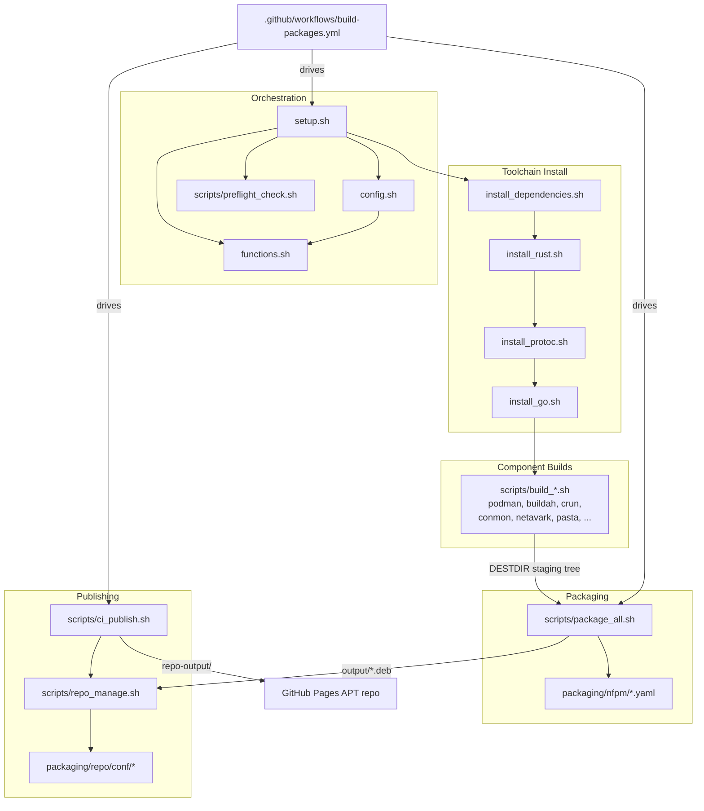

<!-- generated-by: gsd-doc-writer -->
# Architecture

## System Overview

This project is a **source-to-package build and distribution system** for the
Podman container stack on Ubuntu 24.04 (amd64 and arm64). It takes upstream
source repositories (Podman, Buildah, crun, etc.) as input and produces signed
`.deb` packages plus a hosted APT repository as output.

The architecture is a **shell-orchestrated build pipeline** rather than an
application: a top-level orchestrator (`setup.sh`) sources a shared
configuration and function library, then runs a sequence of per-component
build scripts that compile each upstream project from source into a common
staging tree (`DESTDIR`). A packaging stage (`scripts/package_all.sh`) converts
the staging tree into Debian packages with [nFPM](https://nfpm.goreleaser.com/),
and a publishing stage (`scripts/repo_manage.sh` / `scripts/ci_publish.sh`)
assembles those packages into a [reprepro](https://wiki.debian.org/reprepro)
APT repository deployed to GitHub Pages. A GitHub Actions workflow drives the
whole pipeline across three release tracks (stable, edge, nightly) on native
amd64 and arm64 runners.

## Component Diagram



The pipeline is linear: install toolchain, build all components into a shared
staging tree, package the tree, then publish. CI fans the build out across two
native architecture runners before merging artifacts in a single publish job.

## Data Flow

A typical end-to-end run (driven by `.github/workflows/build-packages.yml`)
moves through the system as follows:

1. **Track resolution.** The workflow resolves a build track (`stable`, `edge`,
   or `nightly`). For `stable`, version pins are read from `versions-stable.env`
   and passed as environment variables. For `edge`, component tags are left
   empty so the latest upstream tag is auto-detected. For `nightly`,
   `NIGHTLY_BUILD=true` and `SHALLOW_CLONE=false` are set to build from upstream
   HEAD.

2. **Pre-flight + configuration.** `setup.sh` sources `config.sh` (which sources
   `functions.sh`), detecting the architecture via `detect_architecture()` and
   resolving the Go version from Podman's `go.mod` and the Rust version from
   Netavark's `Cargo.toml`. `scripts/preflight_check.sh` validates the host
   before any build work begins.

3. **Toolchain install.** `setup.sh` runs `install_dependencies.sh`,
   `install_rust.sh`, `install_protoc.sh`, and `install_go.sh` to prepare the
   build environment.

4. **Component compilation.** `setup.sh` runs each `scripts/build_*.sh` in
   sequence. Each build script clones/updates its upstream repository into
   `build/<component>/` (via `git_clone_update`), checks out the requested tag
   (via `git_checkout`), compiles, and installs the resulting binaries into the
   shared `DESTDIR` staging tree (e.g. `${DESTDIR}/usr/bin/netavark`).

5. **Packaging.** `scripts/package_all.sh` iterates the component list, derives
   each package version (from the git tag, or from source files for nightly via
   `extract_version_nightly`), expands the matching `packaging/nfpm/*.yaml`
   config with `envsubst`, and runs `nfpm pkg` to emit a `.deb` into `output/`.
   It also builds the `podman-suite` meta-package.

6. **Publishing.** `scripts/ci_publish.sh` downloads the other suites' existing
   packages from the live repository, then calls `scripts/repo_manage.sh` to
   build a reprepro repository (using `packaging/repo/conf/`), signs it with the
   GPG key, generates `index.html`, and the workflow deploys the result to
   GitHub Pages.

7. **Consumption.** End users add the published APT repository and install
   `podman-suite`, which pulls in all 12 `podman-*` component packages.

## Key Abstractions

The system has no class hierarchy; its abstractions are shell functions and
config conventions. The most significant are:

- **`detect_architecture()`** — `functions.sh`. Normalizes `uname -m` to
  `amd64`/`arm64` and drives all vendor-specific arch strings set in `config.sh`.
- **`get_required_go_version()` / `get_required_rust_version()`** —
  `functions.sh`. Auto-detect the exact toolchain version from upstream
  `go.mod` (Podman) and `Cargo.toml` (Netavark) so build tooling tracks upstream.
- **`git_clone_update()` / `git_checkout()`** — `functions.sh`. Shared
  clone/checkout logic used by every `build_*.sh`; honor `SHALLOW_CLONE` and
  `NIGHTLY_BUILD` to switch between tagged and HEAD builds.
- **`run_script()`** — `setup.sh`. Wrapper that sources each sub-script with
  timing and progress tracking, and records success in `COMPONENTS_OK`.
- **`run_logged()` / `log_build_output()`** — `functions.sh`. Redirect verbose
  build output to per-component log files, dumping the tail to stderr on failure.
- **`error_handler()`** — `functions.sh`. ERR-trap handler installed after
  sourcing config/functions that reports the failing script, line, and exit code.
- **`extract_version()` / `extract_version_nightly()`** —
  `scripts/package_all.sh`. Convert git tags (or source-file versions, for
  nightly) into Debian package versions, applying the `~podman1` suffix.
- **`resolve_tag_from_repo()`** — `scripts/package_all.sh`. For edge builds,
  reads the actually checked-out tag back out of each `build/<component>/` repo.
- **nFPM package configs** — `packaging/nfpm/*.yaml`. Declarative per-component
  package definitions (depends/conflicts/replaces/contents); `${VERSION}`,
  `${ARCH}`, `${DESTDIR}`, and `${CRUN_PARSER_DEPEND}` are filled in at build time.
- **reprepro distribution config** — `packaging/repo/conf/distributions`.
  Defines the `stable`, `edge`, and `nightly` suites (each: amd64 + arm64,
  `main` component, GPG-signed).

## Directory Structure Rationale

The repository is organized around the pipeline stages described above:

```
.
├── setup.sh                # Top-level build orchestrator
├── uninstall.sh            # Removes source-installed components
├── config.sh               # Build configuration: arch, toolchain, versions, caching
├── functions.sh            # Shared shell library (git, logging, error handling)
├── versions-stable.env     # Pinned component versions for the stable track
├── versions-nightly.env    # Version overrides for the nightly track
├── config/                 # Container runtime config shipped with packages
│   └── containers.conf
├── scripts/                # Per-stage and per-component scripts
│   ├── preflight_check.sh  # Host validation before building
│   ├── install_*.sh        # Toolchain installers (rust, go, protoc, deps, ...)
│   ├── build_*.sh          # One compile script per upstream component
│   ├── package_all.sh      # Builds all .deb packages via nFPM
│   ├── repo_manage.sh      # Builds a single-suite reprepro APT repo
│   └── ci_publish.sh       # Multi-suite repo assembly + index.html for CI
├── packaging/
│   ├── nfpm/               # nFPM .deb definitions (one YAML per component + suite)
│   └── repo/               # reprepro repository config + public GPG key
├── tests/                  # Shell unit tests (e.g. version extraction)
├── docs/                   # Project documentation (APT repo guide, this file)
├── build/                  # Build workspace (cloned sources, downloaded tools)
├── log/                    # Per-run and per-component build logs
├── disabled/               # Build scripts kept but not run by setup.sh
└── .github/workflows/      # CI pipeline (build, package, publish to Pages)
```

- **Root-level orchestration files** (`setup.sh`, `config.sh`, `functions.sh`)
  are kept at the top so any sub-script can locate them via a computed
  `toolpath`, regardless of where it is invoked from.
- **`scripts/`** groups the pipeline by responsibility: toolchain install,
  per-component builds, packaging, and publishing — making the `run_script`
  sequence in `setup.sh` map one-to-one to files.
- **`packaging/`** separates declarative package/repository metadata (nFPM and
  reprepro config) from the imperative build logic in `scripts/`.
- **`versions-stable.env` / `versions-nightly.env`** externalize version pins so
  the same scripts serve all three release tracks by environment alone.
- **`build/` and `log/`** are runtime workspaces (cloned sources and logs), kept
  out of the logic directories so they can be cleaned between runs.
