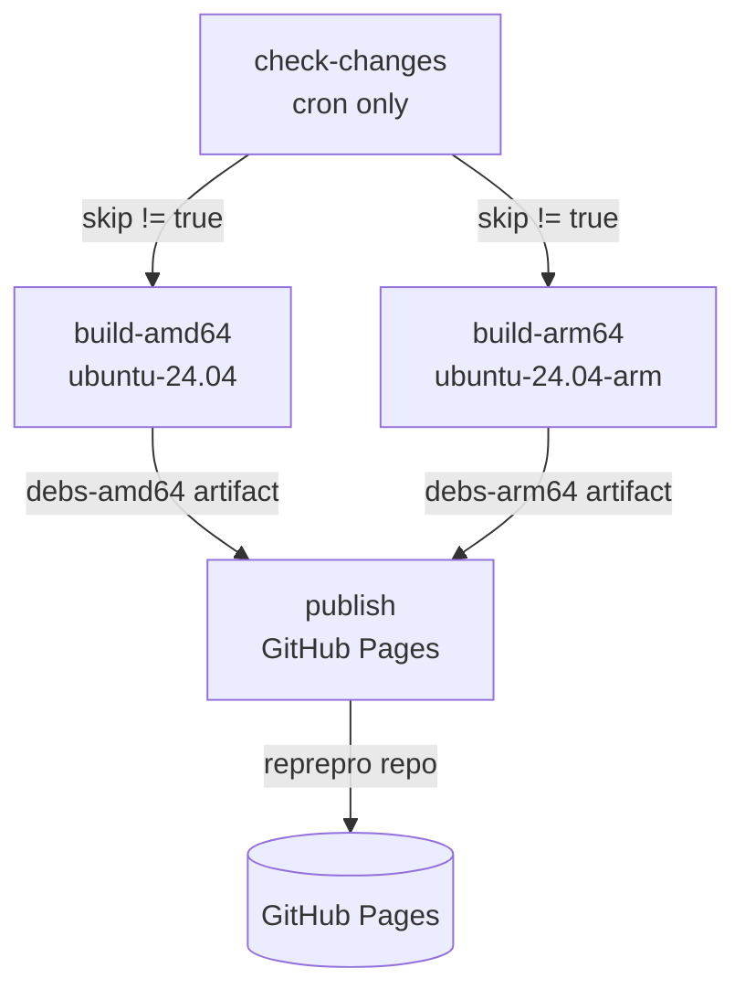

# CI/CD Release Pipeline

## Overview

The release pipeline is driven by a single GitHub Actions workflow,
[`.github/workflows/build-packages.yml`](../.github/workflows/build-packages.yml).
It compiles the full Podman container stack from upstream source on native
amd64 and arm64 runners, packages each component into `.deb` files with nFPM,
assembles them into a [reprepro](https://wiki.debian.org/reprepro)-managed APT
repository, and deploys that repository to GitHub Pages.

The pipeline produces three independent **release tracks** (called *suites* in
APT terminology) — `stable`, `edge`, and `nightly` — that coexist in the same
published repository. A single workflow run rebuilds exactly one track and
preserves the other two by re-importing their existing packages from the live
site.

## Triggers

The workflow runs in two ways:

| Trigger | Event | Track built |
|---------|-------|-------------|
| Nightly cron | `schedule` — `30 4 * * *` (4:30 AM UTC daily) | `nightly` |
| Manual dispatch | `workflow_dispatch` with a `build_track` input | `stable`, `edge`, or `nightly` (chosen) |

For `workflow_dispatch`, the `build_track` input is a required choice of
`stable`, `edge`, or `nightly` and defaults to `stable`. When the workflow is
triggered by the cron schedule, no input is supplied and the track resolves to
`nightly` via the fallback `${{ inputs.build_track || 'nightly' }}`.

Concurrency is pinned to the group `"pages"` with `cancel-in-progress: false`,
so runs that publish to GitHub Pages queue rather than cancel one another.

## Release Tracks

The three tracks differ in which upstream revisions they build. The build track
is resolved into a "Resolve build track" step in each job and then changes how
the build environment is configured before `setup.sh` runs.

| Track | Source of versions | How it's configured in the build step |
|-------|--------------------|---------------------------------------|
| `stable` | Pinned component tags | Every `export VAR=value` line in [`versions-stable.env`](../versions-stable.env) is parsed and passed to `setup.sh` (e.g. `PODMAN_TAG=v5.8.0`). |
| `edge` | Latest upstream tags | Components build from their newest tags; only the pinned build tools `PROTOC_VERSION` / `PROTOC_TAG` are read from `versions-stable.env`. |
| `nightly` | Upstream `main` branch HEAD | Built with `NIGHTLY_BUILD=true SHALLOW_CLONE=false`; versions are derived from source with a `~git{YYYYMMDD}.{sha}` suffix so they sort below tagged releases. |

The published landing page describes the tracks for end users: `stable` is the
recommended, pinned-and-tested track; `edge` tracks the latest upstream tags;
and `nightly` is built from upstream `main` HEAD daily and may break.

The suite names are also declared in the reprepro distributions config,
[`packaging/repo/conf/distributions`](../packaging/repo/conf/distributions),
which defines `stable`, `edge`, and `nightly` for architectures `amd64 arm64`,
component `main`, and `SignWith: yes`.

## End-to-End Flow

The workflow is composed of four jobs that run in sequence:

1. **`check-changes`** (cron runs only) — detects whether any tracked upstream
   repository changed since the last nightly. Sets a `skip` output.
2. **`build-amd64`** and **`build-arm64`** — run in parallel on native runners
   (`ubuntu-24.04` and `ubuntu-24.04-arm`), compile all components, package them
   with nFPM, and upload the resulting `.deb` files as build artifacts.
3. **`publish`** — downloads both architectures' artifacts, builds the reprepro
   repository for the target track, re-imports the other tracks, generates the
   landing page, and deploys everything to GitHub Pages.

### Change detection (`check-changes`)

This job runs only for scheduled (cron) events (`if: github.event_name ==
'schedule'`). It avoids rebuilding the nightly track when nothing upstream has
moved.

- A `actions/cache` entry keyed `nightly-sha-v1` restores the last-known HEAD
  SHAs from `/tmp/nightly-sha.json`.
- For each tracked upstream repository (podman, buildah, crun, conmon, netavark,
  aardvark-dns, skopeo, fuse-overlayfs, catatonit, container-libs, pasta,
  go-md2man, toolbox), the step runs `git ls-remote ... HEAD` and compares the
  remote SHA against the cached value.
- If any SHA changed (or is new), it sets `skip=false`; otherwise `skip=true`.
- The new SHA map is written back to `/tmp/nightly-sha.json`, which the cache
  persists for the next run.

The build jobs gate on this output with
`if: always() && (github.event_name == 'workflow_dispatch' || needs.check-changes.outputs.skip != 'true')`.
Manual dispatches always build; cron runs build only when changes were detected.

### Build jobs (`build-amd64` / `build-arm64`)

Both jobs are structurally identical apart from the runner architecture
(`ubuntu-24.04` vs `ubuntu-24.04-arm`) and the artifact name. Each has a
180-minute job timeout, with the build step itself capped at 150 minutes.

Steps:

1. **Checkout** the repository.
2. **Resolve build track** into a step output (`track`).
3. **Cache Go modules and build cache** under `~/.cache/go-mod` and
   `~/.cache/go-build`, keyed by architecture, track, and run number.
4. **Update apt cache** (`sudo apt-get update`).
5. **Build all components** — constructs an `ENV_ARGS` string based on the
   track (see [Release Tracks](#release-tracks)), then runs
   `sudo env $ENV_ARGS ./setup.sh` to compile everything into a `DESTDIR`
   staging tree under the runner temp directory. Go cache ownership is fixed
   afterward so `actions/cache` can save it.
6. **Install nFPM** — `go install github.com/goreleaser/nfpm/v2/cmd/nfpm@v2.45.0`
   using the Go toolchain that `setup.sh` installed under `/opt/go`.
7. **Package all components** — runs
   [`scripts/package_all.sh`](../scripts/package_all.sh) against the staging
   tree (with `NIGHTLY_BUILD=true` exported for the nightly track) to emit
   `.deb` files into `output/`.
8. **Upload artifact** — uploads `output/*.deb` as `debs-amd64` or `debs-arm64`
   with a 30-day retention.

The packaged components are: podman, crun, conmon, netavark, aardvark-dns,
pasta, fuse-overlayfs, catatonit, buildah, skopeo, toolbox, and
container-configs, plus the `podman-suite` meta-package.

### Publish job (`publish`)

The publish job runs only when both build jobs succeed
(`needs.build-amd64.result == 'success' && needs.build-arm64.result == 'success'`).
It targets the `github-pages` environment and uses the deployment URL produced
by `actions/deploy-pages`.

Steps:

1. **Checkout** the repository.
2. **Resolve build track** (again, since each job is isolated).
3. **Download artifacts** — uses `actions/download-artifact` with
   `pattern: debs-*` and `merge-multiple: true`, combining both architectures'
   `.deb` files into a single `all-debs/` directory.
4. **Install reprepro**.
5. **Build and publish repository** — runs
   [`scripts/ci_publish.sh`](../scripts/ci_publish.sh) with four arguments:
   the resolved track, the `all-debs` directory, the live repository URL
   (`https://<owner>.github.io/<repo>`), and the output directory `repo-output`.
   The GPG private key is supplied via the `GPG_PRIVATE_KEY` environment
   variable from <!-- VERIFY: repository secret `secrets.GPG_PRIVATE_KEY` is configured --> `secrets.GPG_PRIVATE_KEY`.
6. **Configure / upload / deploy Pages** — `actions/configure-pages`,
   `actions/upload-pages-artifact` (path `repo-output/`), and
   `actions/deploy-pages` publish the assembled repository.

The workflow grants `pages: write` and `id-token: write` permissions for the
GitHub Pages deployment. <!-- VERIFY: GitHub Pages is enabled with the "GitHub Actions" source in the repository settings -->

## How Artifacts Move Between Jobs

Because GitHub Actions jobs run on isolated runners, the built `.deb` files are
passed forward as workflow artifacts rather than shared on disk:

- `build-amd64` uploads `output/*.deb` as artifact **`debs-amd64`**.
- `build-arm64` uploads `output/*.deb` as artifact **`debs-arm64`**.
- `publish` downloads both with `pattern: debs-*` and `merge-multiple: true`,
  flattening them into `all-debs/`.

Build artifacts are retained for 30 days. The Go module/build cache is shared
across runs (not between jobs) through `actions/cache`, and the nightly change
detector persists its SHA map through a separate cache entry.

## Multi-Suite Publishing (`ci_publish.sh`)

A single workflow run only builds packages for the **target track**. To avoid
wiping the other two tracks from the published site,
[`scripts/ci_publish.sh`](../scripts/ci_publish.sh) reconstructs a complete
multi-suite repository by combining the freshly built packages with the
existing packages pulled from the live GitHub Pages site.

Its arguments are `<suite> <deb-directory> <repo-url> <output-directory>`, and
it proceeds as follows:

1. **Determine the other suites** — given the target suite, the remaining two of
   `stable`, `edge`, `nightly` are the "other" suites to preserve.
2. **Download other suites' packages** — for each other suite and each
   architecture (`amd64`, `arm64`), it fetches
   `<repo-url>/dists/<suite>/main/binary-<arch>/Packages`, parses the
   `Filename:` lines, and downloads each referenced `.deb` from the live repo.
   A missing `Packages` file (first deploy) is treated as "no packages" and
   skipped.
3. **Build the current suite** — delegates to
   [`scripts/repo_manage.sh`](../scripts/repo_manage.sh) `<suite> <deb-dir>
   <output-dir>`, which imports the GPG key, runs `reprepro includedeb` for each
   fresh `.deb`, exports signed metadata (`InRelease` + `Release.gpg`), copies
   the public key to `podman-ubuntu.gpg`, and removes the reprepro `db/` and
   `conf/` internals.
4. **Re-add the other suites** — restores `conf/distributions` and
   `conf/options`, runs `reprepro includedeb` for each downloaded `.deb` of the
   other suites, then `reprepro export <suite>` per suite (exporting only that
   suite to avoid clobbering the freshly built one), and finally removes the
   reprepro internals again.
5. **Generate `index.html`** — builds the landing page listing each available
   suite with its package count and version table, and substitutes the real
   repository URL for the `REPO_URL_PLACEHOLDER` token.

The result in `repo-output/` is a complete repository containing all three
suites' `dists/` and `pool/` trees, the published GPG public key
(`podman-ubuntu.gpg`), and the generated `index.html`.

## GPG Signing

Repository metadata is GPG-signed so APT clients can verify package integrity.

- The signing key is provided to CI through the `GPG_PRIVATE_KEY` environment
  variable, sourced from <!-- VERIFY: repository secret `secrets.GPG_PRIVATE_KEY` --> `secrets.GPG_PRIVATE_KEY`.
- `repo_manage.sh` imports the key (accepting either a base64-encoded value —
  recommended for CI — or a raw ASCII-armored value) and sets ownertrust to
  ultimate.
- `reprepro export` produces the signed `InRelease` and `Release.gpg` files
  because every suite in
  [`packaging/repo/conf/distributions`](../packaging/repo/conf/distributions)
  declares `SignWith: yes`.
- The matching public key is published at the repository root as
  `podman-ubuntu.gpg` for users to import.

## Related Documentation

- [APT Repository Setup](apt-repository.md) — how end users add the repository
  and install packages from each track.
- [Architecture](ARCHITECTURE.md) — the broader source-to-package build system
  that the CI pipeline orchestrates.
